

# The Resource Explorer Mod

`//todo links once pages are approved`

### A mod allowing the exploration & exporting of all the resources & packs available to Minecraft, as it sees them.

### To help resource-pack makers with creating packs and exploring modded asset locations, without having to open .jar files or deal with dozens of separate resource-packs & mods

# Examples

## Viewing game resources
### Textures
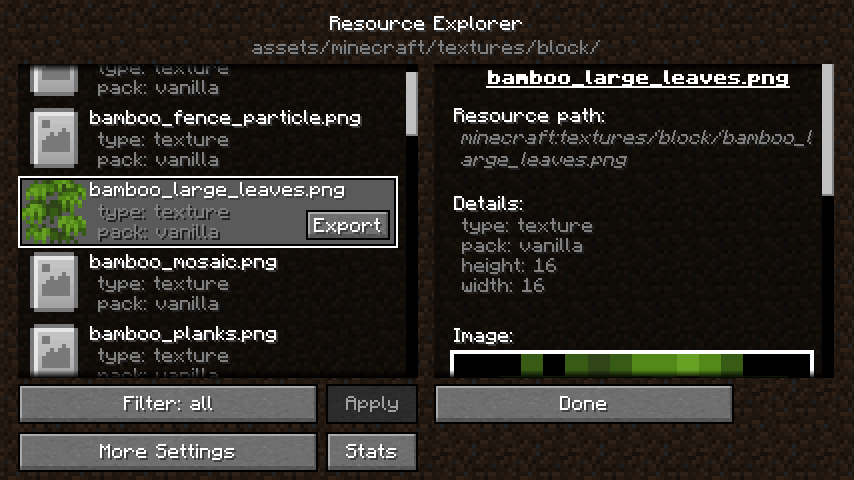
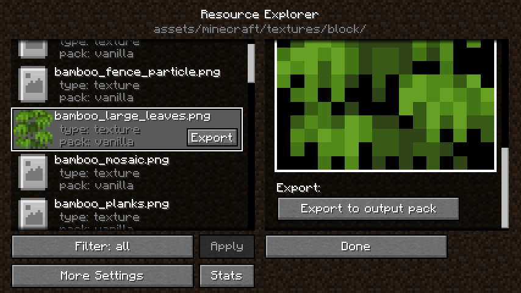

### Text
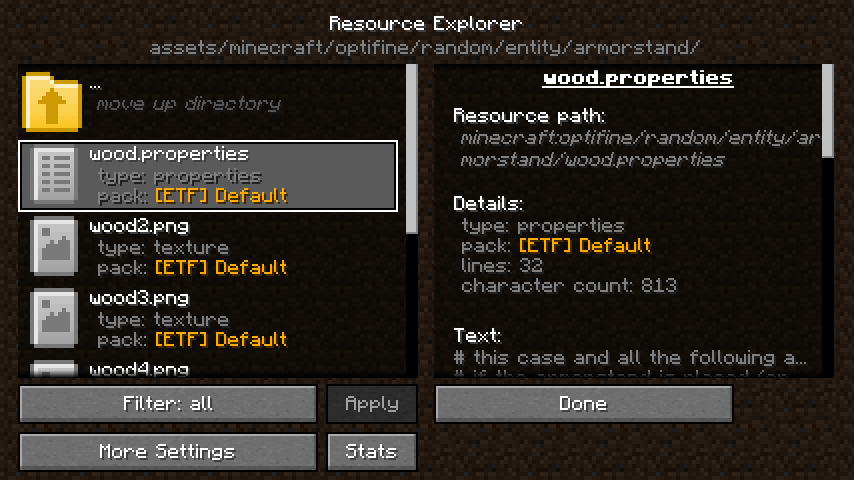

### Sounds
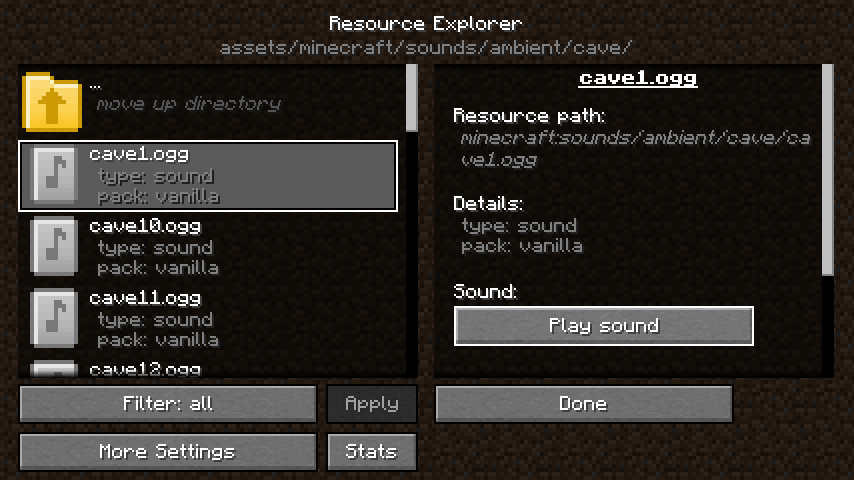

### Even in-game built assets

## Exporting assets and folders
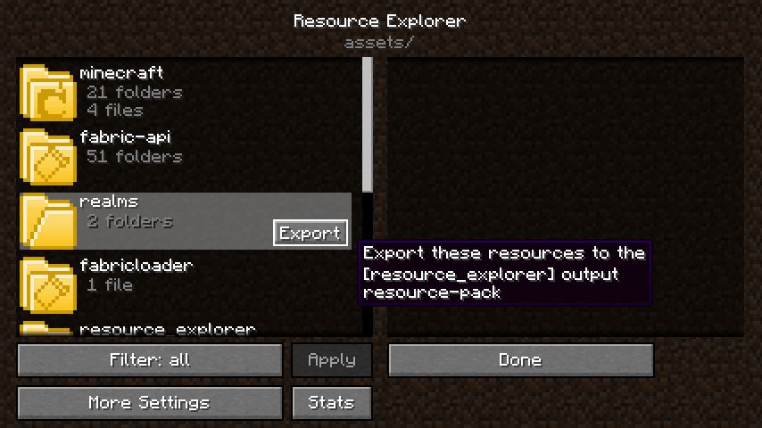
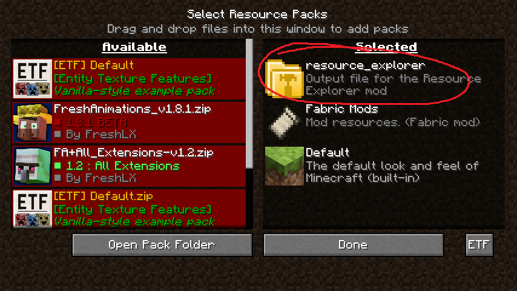

## Config and quick access via options screen
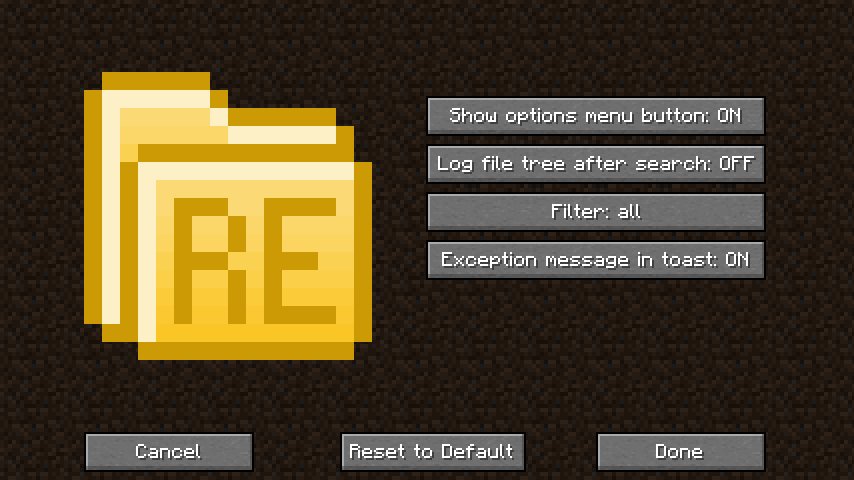
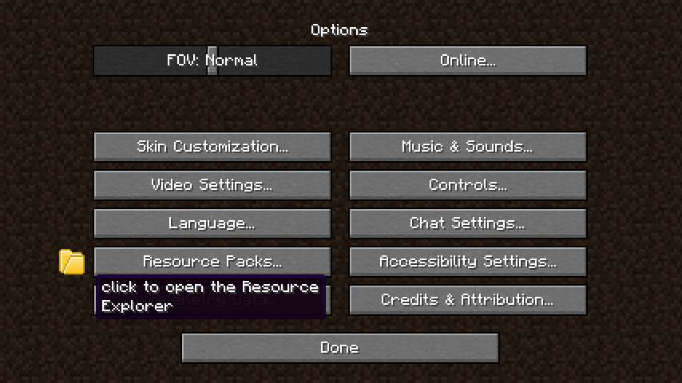

## Resource breakdown statistics
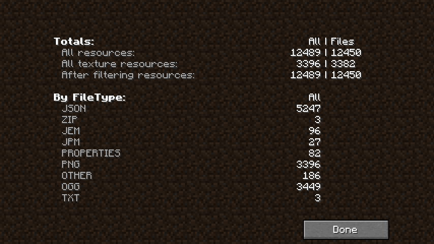
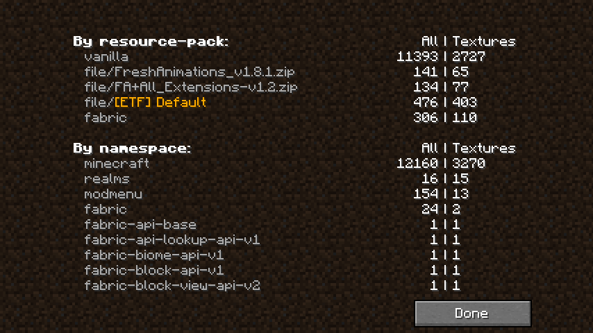

## Mod asset support
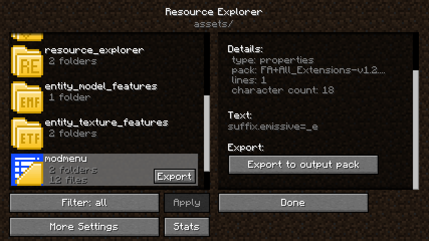

