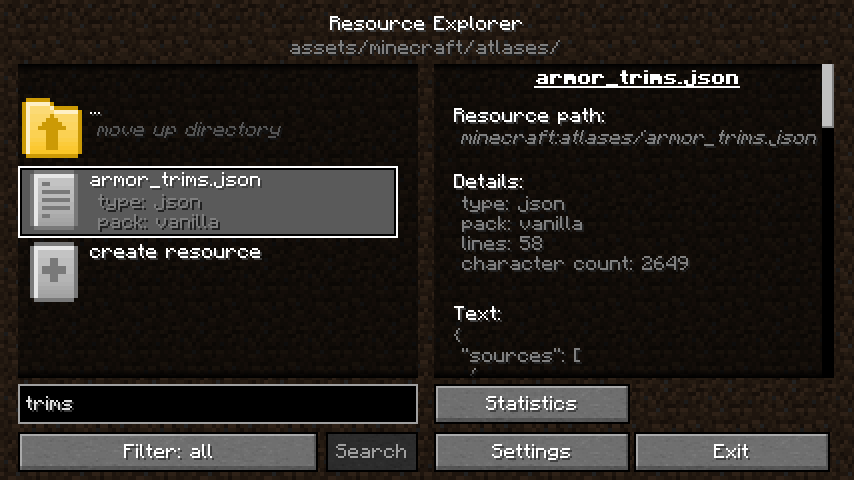
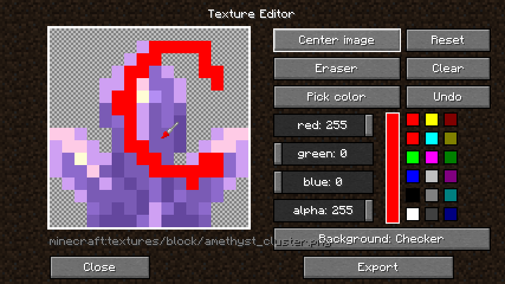
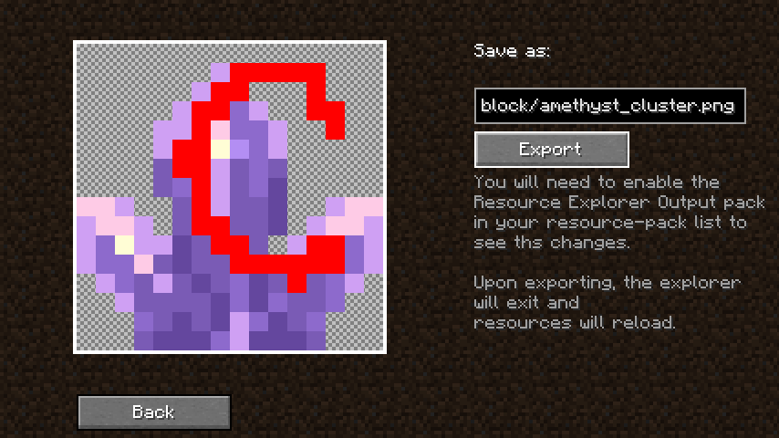
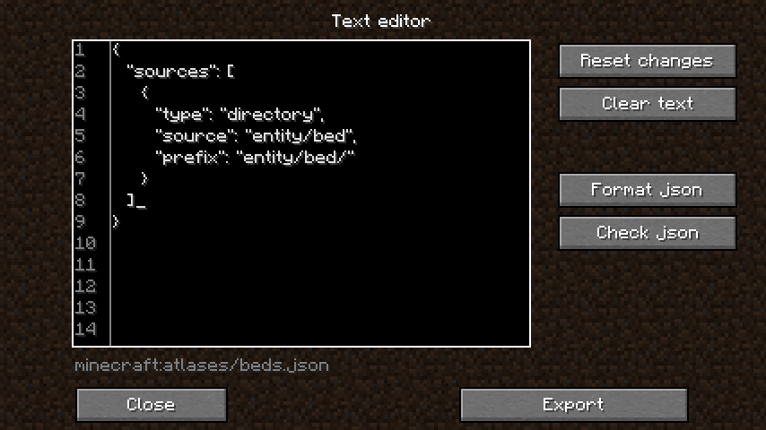
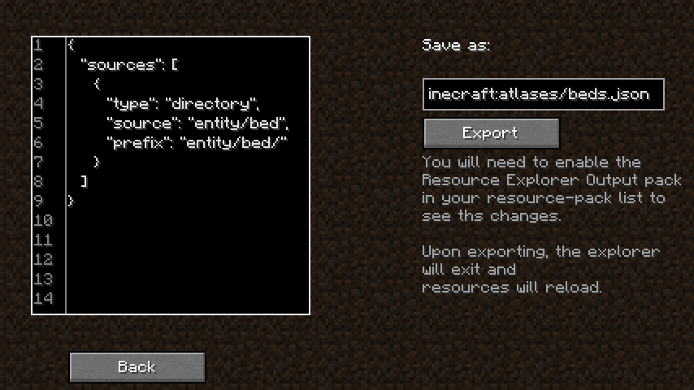
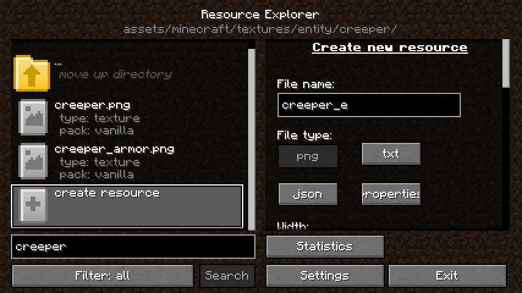

# The Resource Explorer Mod

### A mod allowing the exploration, editing, & exporting of all the resources & assets available to Minecraft, as it sees them.

*(Basically a Windows explorer / editor for Minecraft's resource-pack assets)*

### To help resource-pack makers with creating packs and exploring modded asset locations, without having to open .jar files or deal with dozens of separate resource-packs & mods

# Exploring | Editing | Exporting
# *Examples*

## Viewing game resources

### Search function
*(new ui image of V1.1)*

### Textures
*(old ui image of V1.0)*

### Text

### Sounds

### Even in-game built assets

## Editing assets
#### Edit & export image assets

#### Edit & export text assets

#### Create & export new text or image assets

## Exporting assets and folders
#### Do not re-distribute un-altered vanilla / mod / resource-pack, assets without permission!

## Config and quick access via options screen

## Resource breakdown statistics

## Mod asset support

# Reminder: Do not re-distribute un-altered vanilla / mod / resource-pack, assets without permission!

